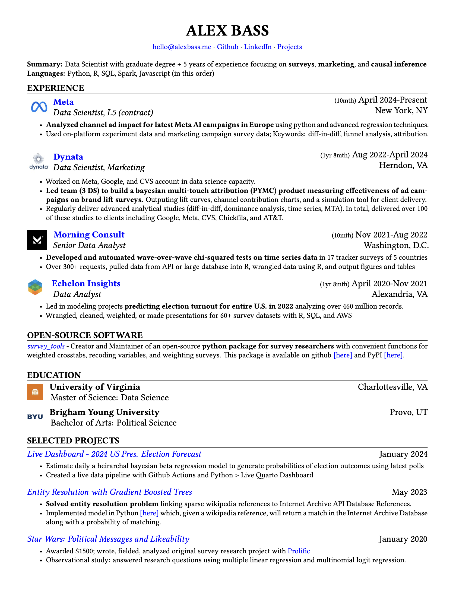

# Simple Quarto Resume Template
My personal CV template with Latex and Quarto.  

Wrote up a blog post about this [here](https://alexbass.me/posts/resume/). 

TLDR: Feel free to copy and use as you like. Most of it is built in LaTeX, so google that if you want to customize the template. Shell script is also included to show a few file automations when updating my resume.

I have gone through a few different versions throughout the last few years of this resume. I have the legacy versions in the repository as well. The latest version is V3 and I have a picture of this below.

